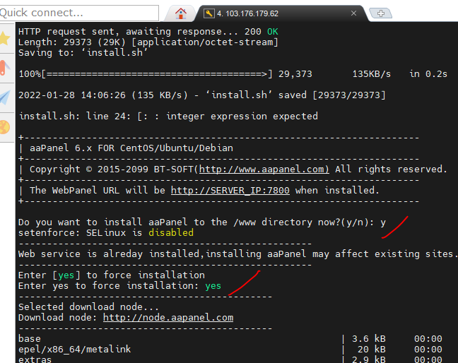
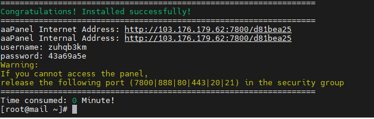
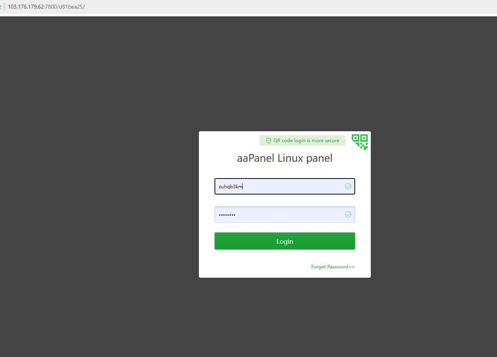

# Cài aaPanel trên Centos 7

## Các bước cài

- Đảm bảo hệ thống đã được update và upgrade đầy đủ

- Chạy lệnh:
    + yum install -y wget && wget -O install.sh http://www.aapanel.com/script/install_6.0_en.sh && bash install.sh

- 

- Thông tin đăng nhập lưu ở dưới:

## Truy cập 

- Tại trình duyệt vào link: http://103.176.179.62:7800/d81bea25

- Nhập user, pass được cấp:

