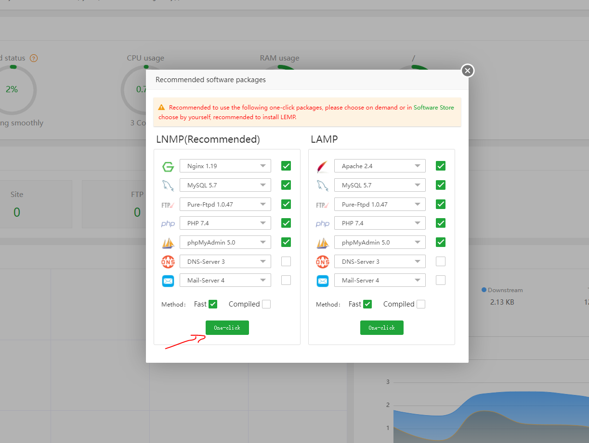
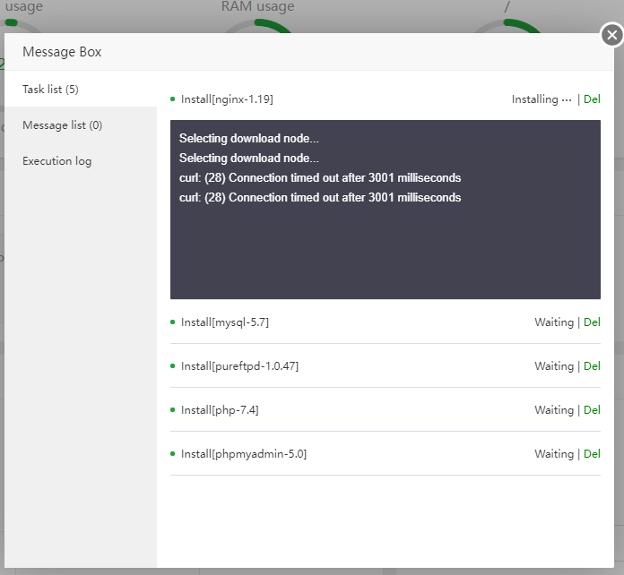
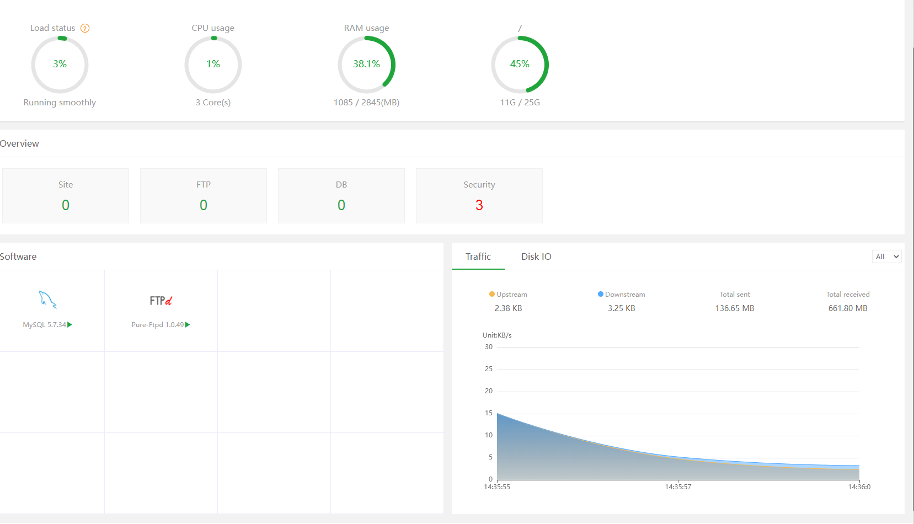
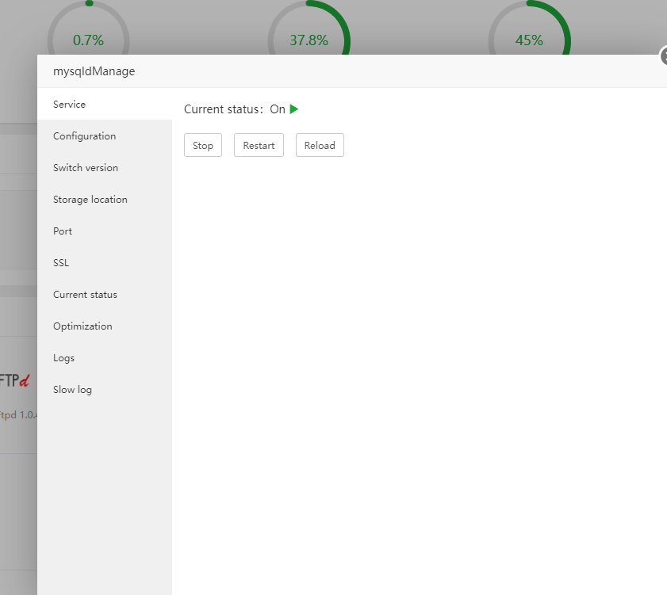
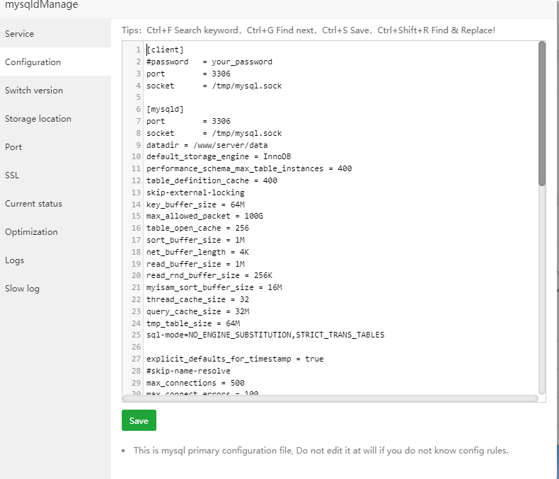
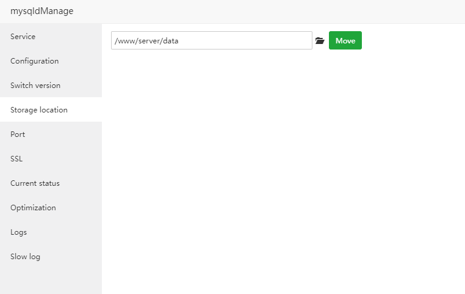

# Thiết lập ban đầu và một số tính năng
## Thiết lập ban đầu
1. Ở đây sẽ cài đặt LEMP.

2. Ngồi đợi cài đặt các tiến trình:

## Các tính năng

1. Trang home 

- Có các thông tin liên quan đến phần cứng của hệ thống, những phần mềm đã cài đặt.

- Ngoài ra còn thể hiện lượng traffic truy cập

2. Tại hôm có thể quản lí các server 1 cách dễ dàng như bật tắt dịch vụ, cấu hình, chuyển đổi phiên bản ....

- Và còn nhiều cái nữa để khám phá.

