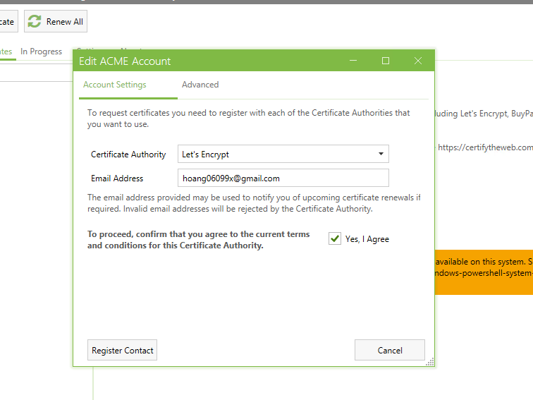
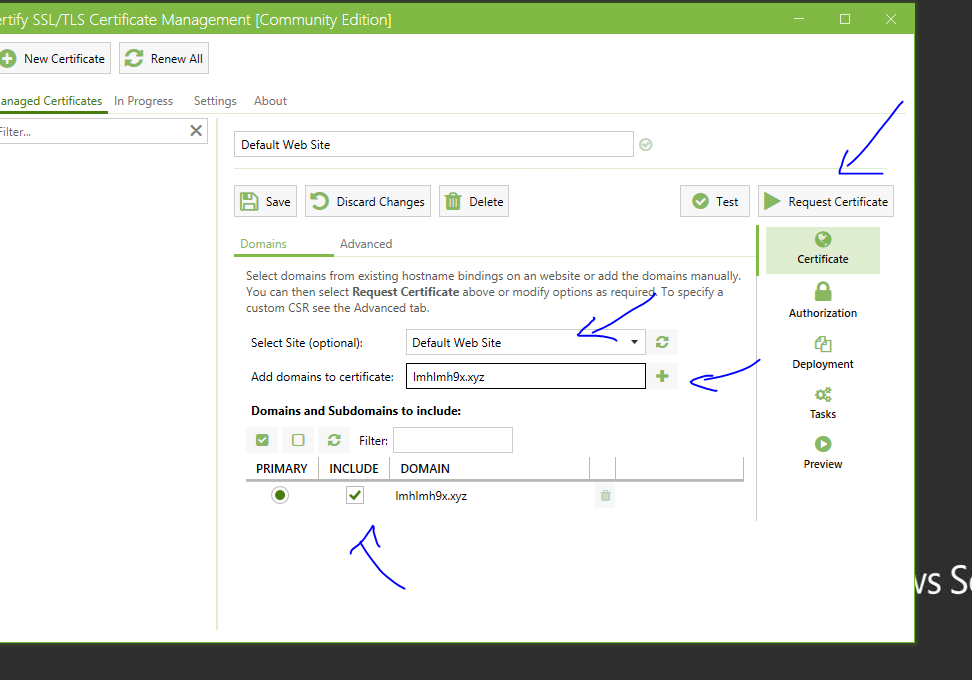

# Cài SSL miển phí Let's Encrypt trên IIS bằng công cụ Certify the web.
## 1. Tải xuống 
- Tải từ link https://certifytheweb.com/ và cài đặt.

## 2. Đăng kí
- Nhập mail và đăng kí

## 3. Tạo chứng chỉ mới
- Chọn New Cer, chố site chọn 1 site, sau đó nhập domain và add. Tiếp đến Request Cer.

- 