# Cài Zimbra 9 trên Centos 7

## Trước hết cần:
1. Remove package httpd
yum remove httpd -y

2. Tắt sendmail 

service sendmail stop
systemctl disable sendmail
---------------------------------------
*https://imanudin.net/2020/05/03/how-to-install-zimbra-9-open-source-edition-unofficial-on-centos-7/*

*https://kb.nhanhoa.com/pages/viewpage.action?pageId=33817127*
1. Cài wget và screen
- yum install wget screen -y

2. Dowload script tự động cấu hình
- screen -S install-zimbra
- wget -c https://raw.githubusercontent.com/imanudin11/script/master/persiapan-zimbra-centos7.sh
- chmod +x persiapan-zimbra-centos7.sh
- ./persiapan-zimbra-centos7.sh

- Nhập thông tin :

    + Hostname. Example mail : mail
    + Domain name. Example imanudin.net : titmit.xyz
    + IP Address : 103.28.38.21

3. Dowload Zimbra
- cd /opt/
- wget -c https://s3.beezim.fr/beebot/upload/09830127-c2f1-43cb-b3fa-c35fc514e539/zcs-9.0.0_GA_1.RHEL7_64.20200411070311.tgz 

4. Giải nén
- tar -zxvf zcs-9.0.0_GA_1.RHEL7_64.20200411070311.tgz

5. Chạy để cài
- cd zcs-9.0.0_GA_1.RHEL7_64.20200411070311

./install.sh
- Follow theo ảnh
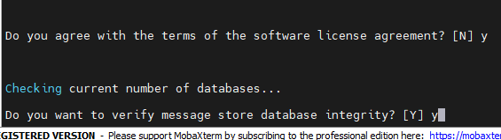
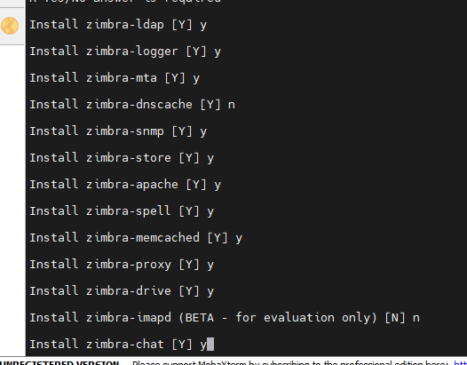
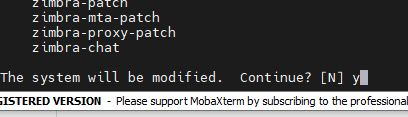
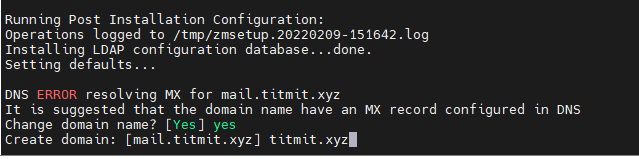
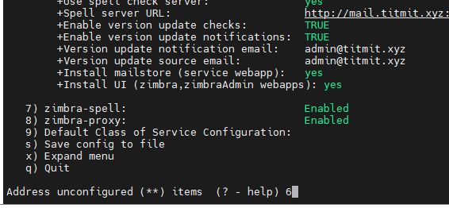
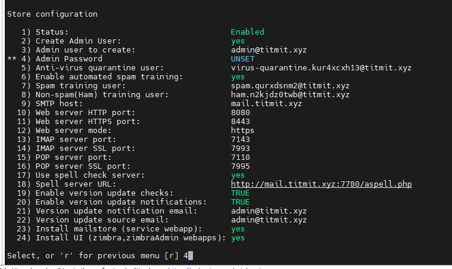
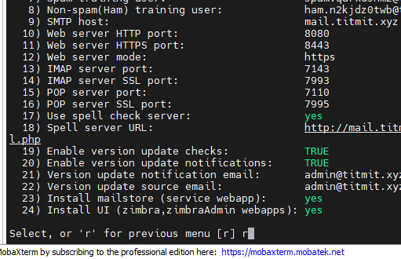
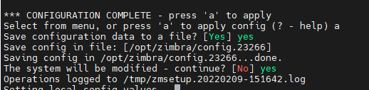
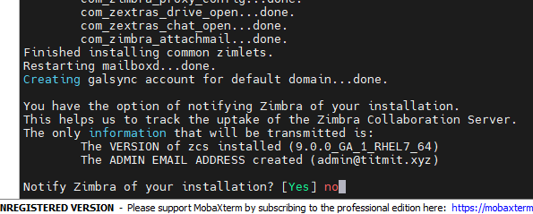
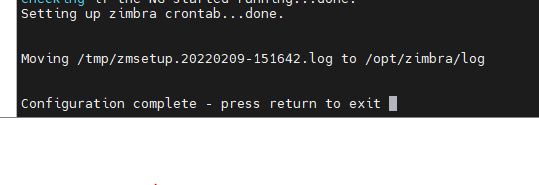
- Thế là xong

6. Kiểm tra lại trạng thái

- su zimbra

- zmcontrol status
-------------------
### Blocking Memcached Exploit
Configure memcached to listen on 127.0.0.1 only to avoid this attack. Use below commands.
su - zimbra
 /opt/zimbra/bin/zmprov ms `zmhostname` zimbraMemcachedBindAddress 127.0.0.1 
 /opt/zimbra/bin/zmprov ms `zmhostname` zimbraMemcachedClientServerList 127.0.0.1

Restart memcached:
zmmemcachedctl restart

7. Truy cập thử bằng đường dẫn 

https://mail.titmit.xyz:7071/

- Tên đăng nhập là admin, pass tạo ở trên.

- Muốn vào mailbox đổi thành port 8443

## Xác thực cho mailserver

- Khi gửi ra ngoài như gmail sẽ bị chặn và không gửi được.
- Cách khắc phục là tạo các record spf, dkim, dmarc.

1. Tạo spf

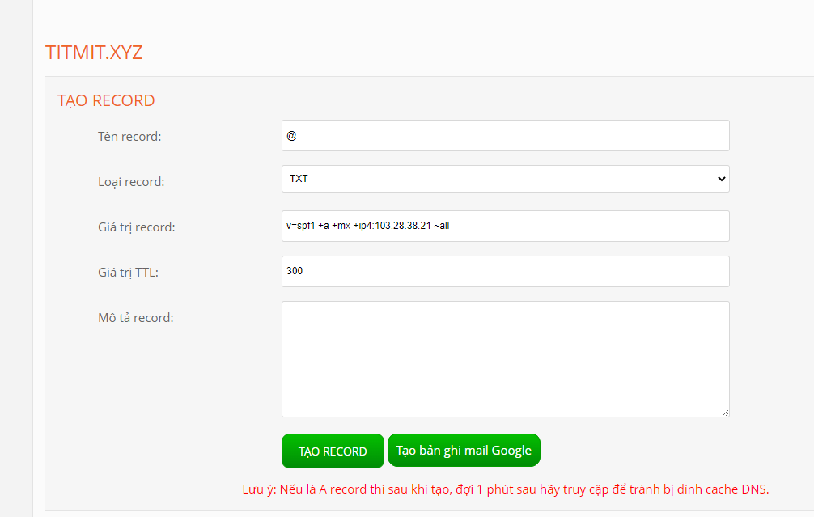
2. Tạo dmarc

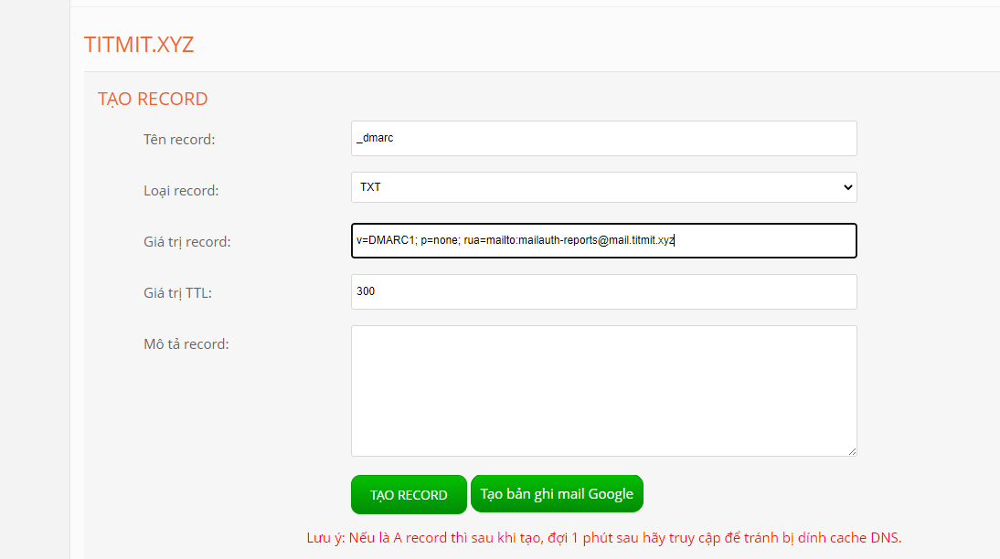

3. Tạo dkim
- su zimbra
- Active dkim cho mailserver
    + /opt/zimbra/libexec/zmdkimkeyutil -a -d titmit.xyz

- Lấy thông tin dkim
    + /opt/zimbra/libexec/zmdkimkeyutil -q -d titmit.xyz

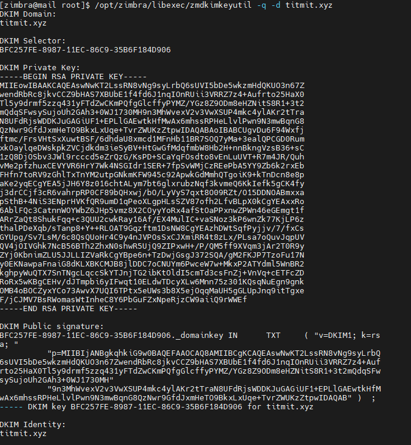

- Tiếp đến tạo record dkim.

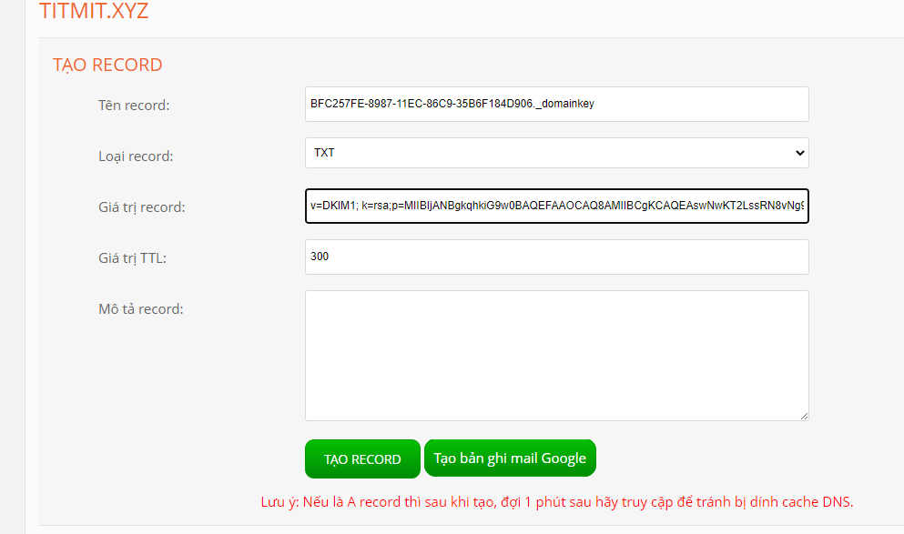

- Xong trông ntn:

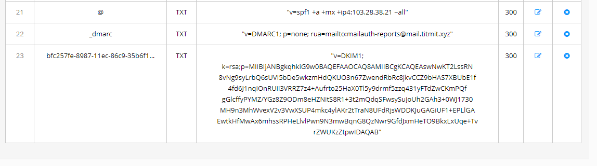

5. Khởi động lại
- su zimbra
- zmcontrol restart