# Các bước triển khai
## Cài core
1. Tải bản cài
- Link : https://www.microsoft.com/en-us/download/details.aspx?id=50003

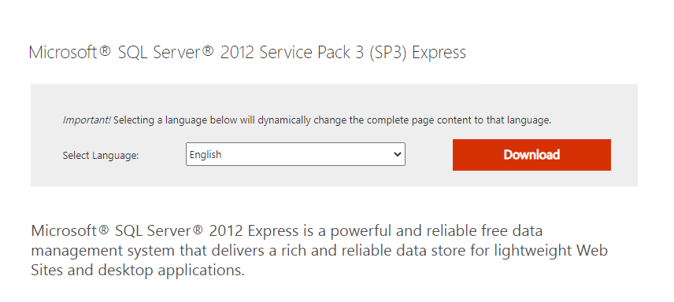

- Chọn bản cài

2. Follow theo các bước dưới hình

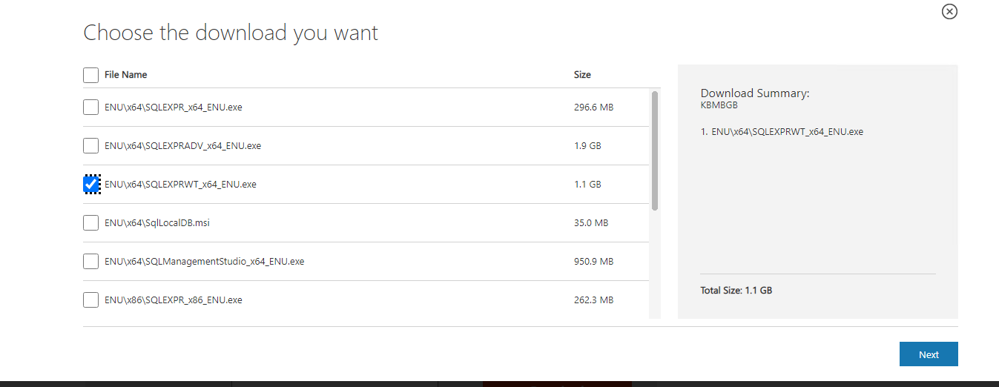
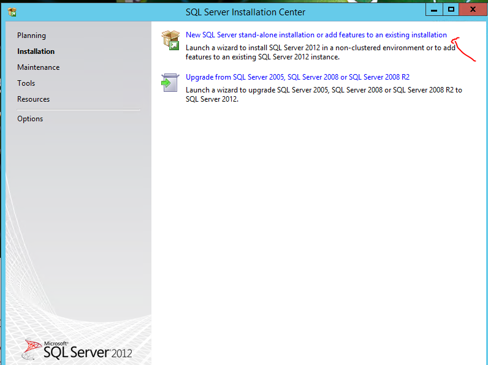
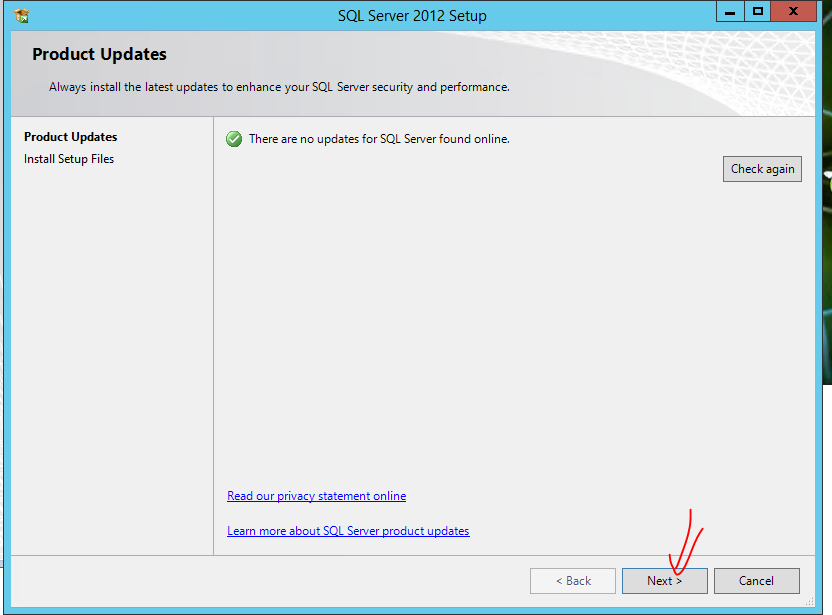
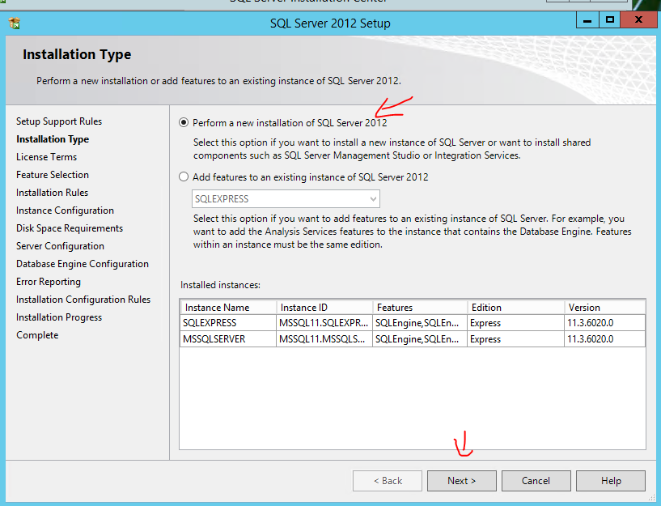
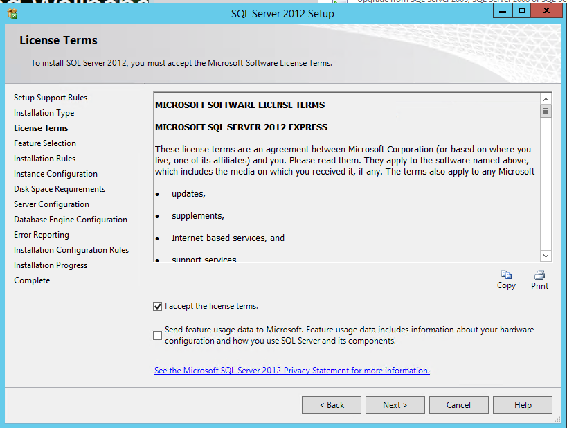
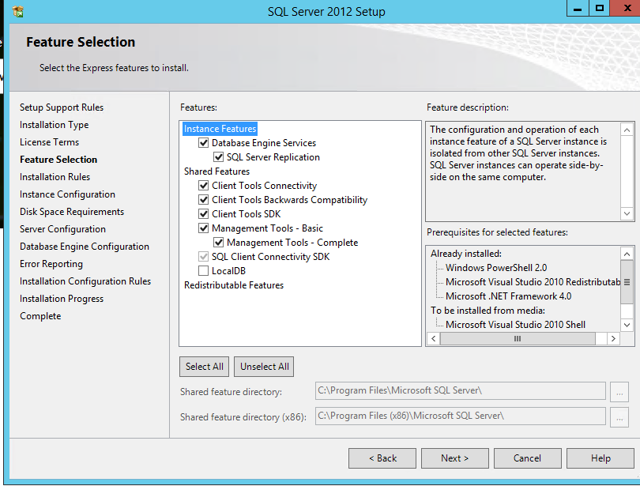
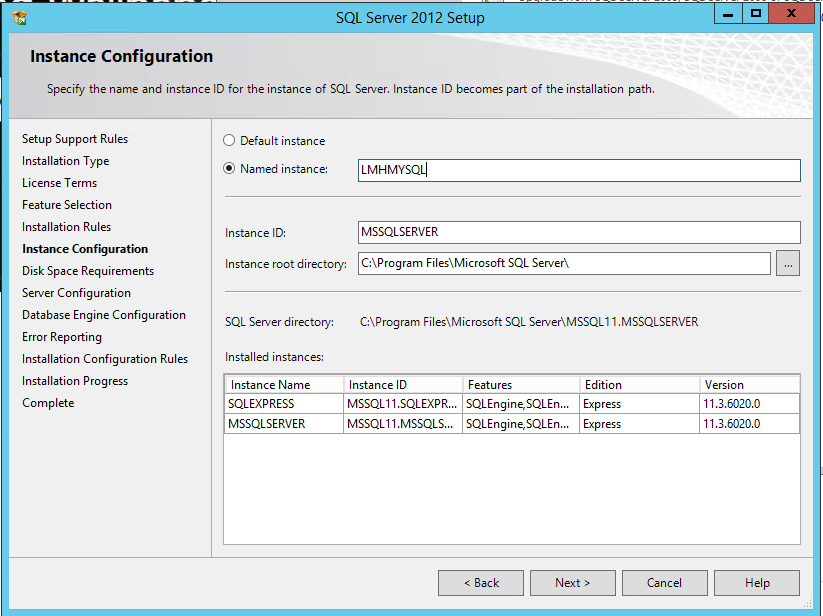
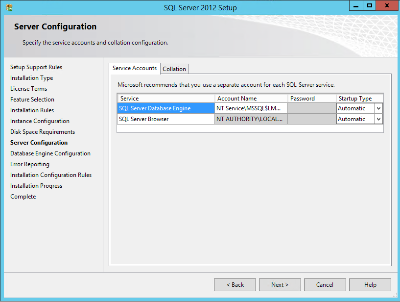
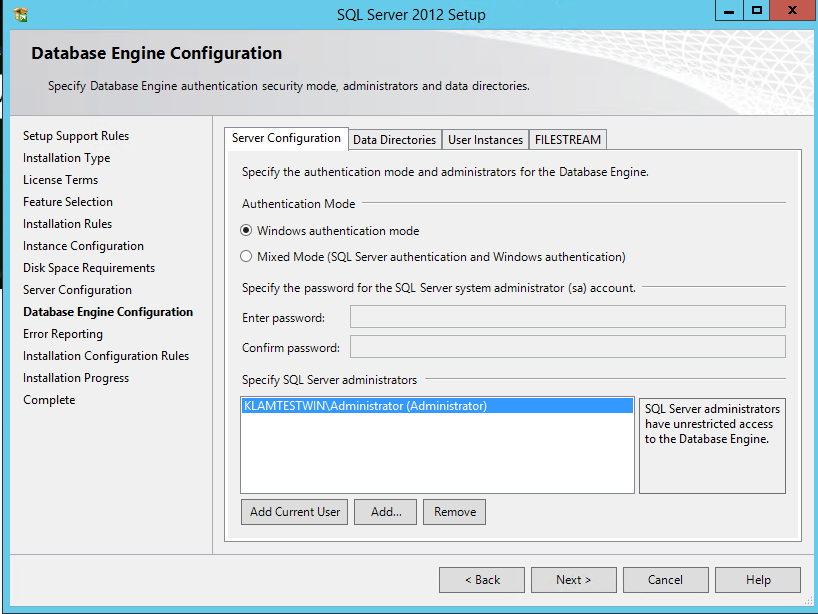
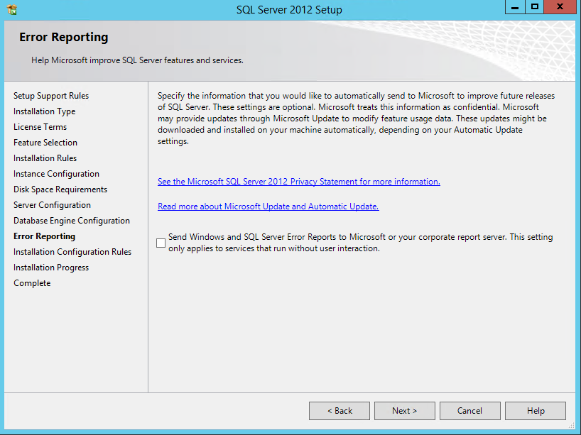

3. Xong thì như thế này
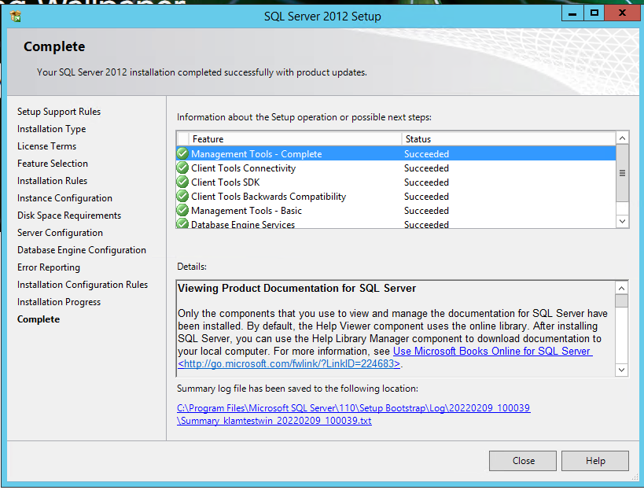

 
## Cài giao diện quản lí SMSS
1. Link : 
- https://docs.microsoft.com/en-us/sql/ssms/download-sql-server-management-studio-ssms?view=sql-server-ver15

2. Chạy file cài:
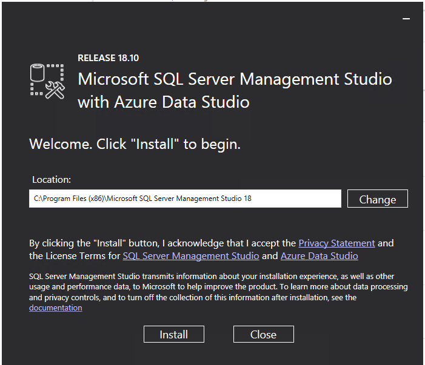

- Cài xong thì restart.

## Dùng
1. Vào tìm kiếm gõ ssms để vào trình quản lí. Sao đó connect đến DB

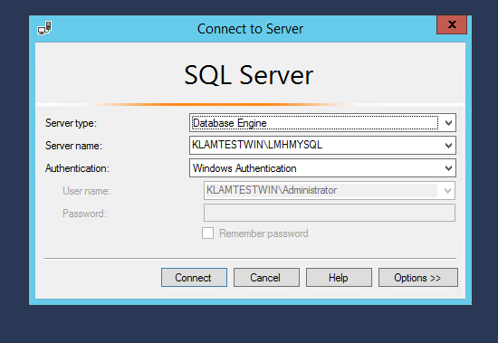

2. Tạo DB mới
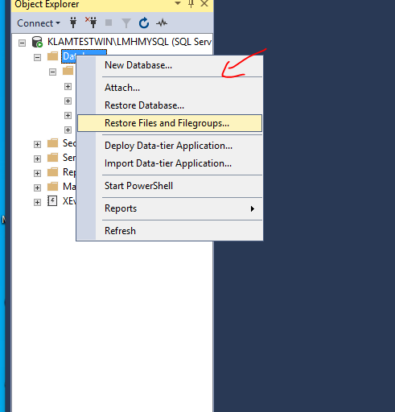
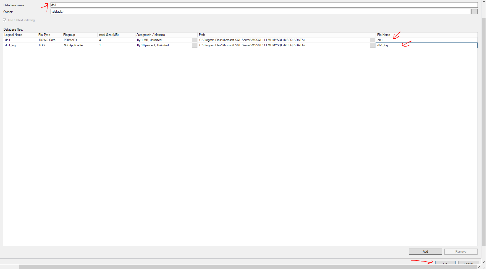

3. Thực hiện query :

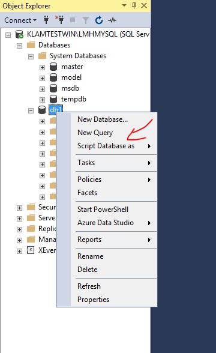
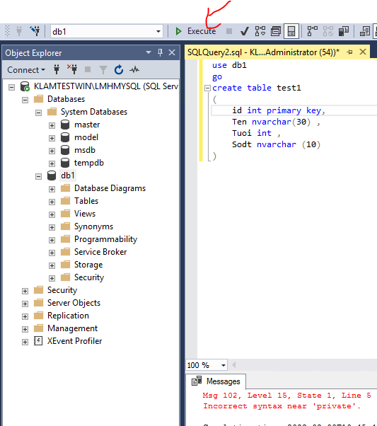

- OK
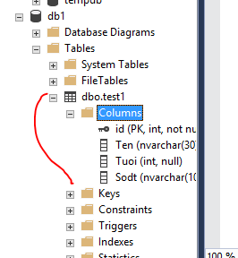

