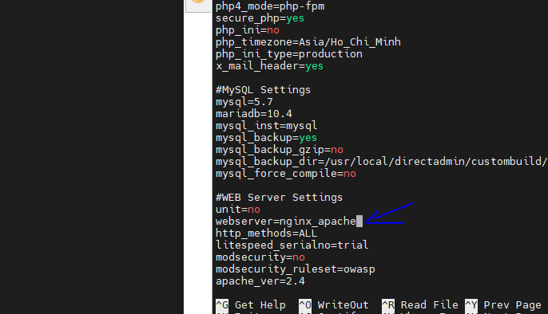
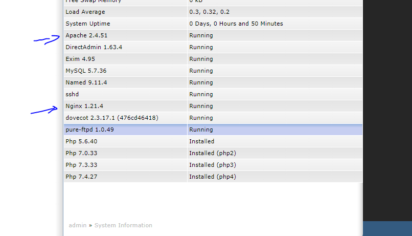

## Kết hợp Nginx và Apache
### Apache tốt hơn Nginx trong việc phục vụ các trang web động, nhưng Nginx lại tốt hơn Apache trong việc phục vụ các trang web tĩnh. Do đó, để tận dụng ưu thế của cả 2 web server này, khái niệm reverse proxy đã ra đời.
### Ở đây, Nginx được sử dụng như 1 reverse proxy của Apache. Đối với nội dung tĩnh là lợi thế của Nginx, các file sẽ được Nginx phục vụ một cách nhanh chóng và trực tiếp cho client. Còn đối với nội dung động là lợi thế của Apache, Nginx sẽ chuyển cho Apache thực hiện sau đó trả kết quả về cho Nginx, rồi Nginx trả kết quả đó lại cho client. Nói 1 cách đơn giản hơn là dùng Nginx để xử lý tập tin tĩnh (CSS, JS, HTML, …) và dùng Apache xử lý các tập tin động (PHP,…).

## Build reverse-proxy NGINX-Apache trên Directadmin
1. cd /usr/local/directadmin/custombuild
2. Sửa cấu hình webserver trong option.conf

3. ./build update
4. ./build nginx_apache

5. Sau khi xong dùng lệnh ./build rewrite_confs để cập nhật cấu hình

